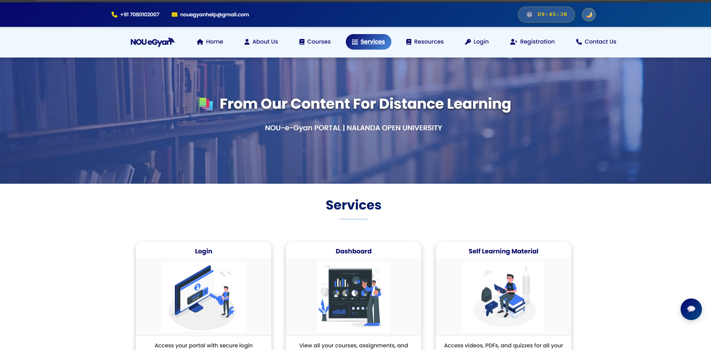

<h1 align="center">Learning Management System 📚</h1>

<p align="center">
  <strong>A comprehensive Django-based Learning Management System built for Nalanda Open University to streamline educational workflows.</strong>
  <br />
  <br />
  <a href="https://learning-management-system-nalanda-open-l069.onrender.com/"><strong>🌐 Live Demo</strong></a>
  ·
  <a href="https://github.com/ShailjaVerma18/Learning-Management-System-Nalanda-Open-University-/issues"><strong>🐛 Report a Bug</strong></a>
  ·
  <a href="https://github.com/ShailjaVerma18/Learning-Management-System-Nalanda-Open-University-/issues"><strong>✨ Request a Feature</strong></a>
</p>

<p align="center">
  <a href="https://github.com/ShailjaVerma18/Learning-Management-System-Nalanda-Open-University-/stargazers"></a>
  <a href="https://github.com/ShailjaVerma18/Learning-Management-System-Nalanda-Open-University-/blob/main/LICENSE"></a>
  <a href="https://github.com/ShailjaVerma18/Learning-Management-System-Nalanda-Open-University-/network/members"></a>
</p>

---


## 📸 Application Screenshots

<div align="center">

### Home Page


### Courses Catalog


### Admin App


### Student App


### About Us


### Services


</div>

---

## 🌟 The Mission: Empowering Digital Education

Educational institutions need robust, scalable platforms to manage their learning processes effectively. Traditional LMS solutions are often expensive, inflexible, or require extensive customization.

**This Learning Management System** changes that.

Built specifically for Nalanda Open University, this platform provides a complete, feature-rich solution for managing educational workflows. It's designed with modern web technologies, ensuring scalability, maintainability, and an excellent user experience for both students and faculty.

### 🔥 Core Features

*   **👥 Multi-Role Management:** Separate dashboards and permissions for students, faculty, and administrators
*   **📖 Course Management:** Create, organize, and manage courses with multimedia content support
*   **🎯 Assignment System:** Comprehensive assignment creation, submission, and grading workflows
*   **📊 Advanced Analytics Dashboard:** Real-time insights into platform activities, user engagement, and academic performance
*   **🤖 AI-Powered Chatbot:** Intelligent assistant for instant student support and query resolution
*   **💬 Discussion Forums:** Interactive platform for collaborative learning and peer discussions
*   **📢 News & Events Management:** Centralized system for announcements and institutional updates
*   **📋 Feedback & Complaints System:** Structured channels for student feedback and grievance management
*   **🔍 Smart Search:** Advanced search functionality for quick resource discovery
*   **🔐 Secure Authentication:** Robust user registration, login, and session management
*   **📱 Responsive Design:** Mobile-first approach ensuring accessibility across all devices
*   **⚡ Performance Optimized:** Built with Django's best practices for speed and reliability

---

## 🏗️ System Architecture

The platform follows Django's MVT (Model-View-Template) architecture with a clean separation of concerns and enterprise-grade PostgreSQL database:

```
┌─────────────────┐    ┌─────────────────┐    ┌─────────────────┐
│   Frontend      │────│   Django App    │────│   Database      │
│   (Templates)   │    │   (Views/URLs)  │    │   (PostgreSQL)  │
└─────────────────┘    └─────────────────┘    └─────────────────┘
```

<details>
  <summary><strong>Click to explore the detailed system workflow</strong></summary>

  ### User Journey Flow

  1. **Authentication Layer:** Users authenticate through Django's built-in authentication system with custom user models
  2. **Role-Based Routing:** The system routes users to appropriate dashboards based on their roles (Student/Faculty/Admin)
  3. **Course Management:** Faculty can create courses, upload materials, and manage enrollments
  4. **Student Learning Path:** Students can enroll in courses, access materials, submit assignments, and track progress
  5. **Interactive Learning:** Students participate in discussion forums and engage with AI-powered support
  6. **Feedback Loop:** Integrated feedback, complaints, and enquiry management system
  7. **Assessment & Feedback:** Comprehensive grading system with feedback mechanisms
  8. **Analytics Dashboard:** Real-time insights into learning metrics, system usage, and institutional performance

</details>

---

## 🚀 The Tech Stack: Modern & Reliable

Every technology choice prioritizes developer experience, performance, and educational sector requirements.

| Component         | Technology                    | Why We Chose It                                                                                                     |
| ----------------- | ----------------------------- | ------------------------------------------------------------------------------------------------------------------- |
| **Backend**       | **Python & Django**          | **Rapid Development.** Django's "batteries included" philosophy accelerates development while maintaining security and scalability. |
| **Frontend**      | **HTML5, CSS3 & JavaScript** | **Universal Compatibility.** Clean, semantic markup with progressive enhancement ensures accessibility across all devices and browsers. |
| **Database**      | **PostgreSQL**                | **Enterprise-Grade Reliability.** Robust, scalable RDBMS with advanced features for handling complex academic data and concurrent users. |
| **UI Framework**  | **Bootstrap/Custom CSS**      | **Responsive Design.** Mobile-first approach with consistent, professional styling across the platform. |
| **AI Integration**| **Custom AI Chatbot**         | **Intelligent Support.** Automated student assistance for enhanced user experience and reduced support workload. |

<details>
  <summary><strong>Explore the Project Directory Structure</strong></summary>

  ```
  lms/
  ├── lms_project/              # Main Django project settings
  │   ├── settings.py           # Configuration settings
  │   ├── urls.py              # URL routing
  │   └── wsgi.py              # WSGI configuration
  ├── apps/                    # Django applications
  │   ├── accounts/            # User management & authentication
  │   ├── admin_app/           # Admin dashboard & analytics
  │   │   ├── views.py         # Analytics, student management
  │   │   ├── models.py        # Study materials, news & events
  │   │   └── templates/       # Admin interface templates
  │   ├── student_app/         # Student portal
  │   │   ├── views.py         # Dashboard, discussions, feedback
  │   │   ├── models.py        # Complaints, enquiries, profile
  │   │   └── templates/       # Student interface templates
  │   ├── courses/             # Course management system
  │   ├── assignments/         # Assignment & submission handling
  │   ├── grades/              # Grading & assessment system
  │   └── chatbot/             # AI chatbot integration
  ├── static/                  # Static files (CSS, JS, images)
  │   ├── css/
  │   ├── js/
  │   └── images/
  ├── templates/               # HTML templates
  │   ├── base.html            # Base template
  │   ├── home.html            # Home page with search & AI bot
  │   ├── accounts/
  │   ├── courses/
  │   └── dashboard/
  ├── media/                   # User uploaded files & study materials
  ├── requirements.txt         # Python dependencies
  └── manage.py               # Django management script
  ```

</details>

---

## 🛠️ Getting Started

Simple setup process to get your LMS running locally in minutes.

### Prerequisites

1. **Python 3.8+:** [Download Python](https://www.python.org/downloads/)
2. **PostgreSQL 12+:** [Download PostgreSQL](https://www.postgresql.org/download/)
3. **Git:** [Install Git](https://git-scm.com/downloads)
4. **Virtual Environment:** (Recommended for dependency isolation)

### Installation & Setup

1. **Clone the Repository:**
   ```bash
   git clone https://github.com/ShailjaVerma18/Learning-Management-System-Nalanda-Open-University-.git
   cd Learning-Management-System-Nalanda-Open-University-
   ```

2. **Create & Activate Virtual Environment:**
   ```bash
   # On Windows
   python -m venv venv
   venv\Scripts\activate

   # On macOS/Linux
   python3 -m venv venv
   source venv/bin/activate
   ```

3. **Install Dependencies:**
   ```bash
   pip install -r requirements.txt
   ```

4. **Database Setup:**
   
   **Create PostgreSQL Database:**
   ```bash
   # Access PostgreSQL
   psql -U postgres
   
   # Create database
   CREATE DATABASE lms_nalanda;
   CREATE USER lms_user WITH PASSWORD 'your_password';
   GRANT ALL PRIVILEGES ON DATABASE lms_nalanda TO lms_user;
   \q
   ```
   
   **Configure Database in settings.py:**
   ```python
   DATABASES = {
       'default': {
           'ENGINE': 'django.db.backends.postgresql',
           'NAME': 'lms_nalanda',
           'USER': 'lms_user',
           'PASSWORD': 'your_password',
           'HOST': 'localhost',
           'PORT': '5432',
       }
   }
   ```

5. **Run Migrations:**
   ```bash
   python manage.py makemigrations
   python manage.py migrate
   ```

6. **Create Superuser:**
   ```bash
   python manage.py createsuperuser
   ```

7. **Collect Static Files:**
   ```bash
   python manage.py collectstatic
   ```

8. **Run the Development Server:**
   ```bash
   python manage.py runserver
   ```

9. **🎉 Access Your LMS:**
   - **Main Application:** `http://127.0.0.1:8000`
   - **Admin Panel:** `http://127.0.0.1:8000/admin`

---

## 📋 Key Features Breakdown

### 🏠 Home Page Features
- **Advanced Search Bar:** Quick search across courses, materials, and resources
- **AI Chatbot:** Intelligent virtual assistant for instant help and guidance
- **About Section:** Comprehensive information about Nalanda Open University
- **Courses Catalog:** Browse and explore available courses
- **Services Overview:** Detailed information about platform capabilities
- **Resources Library:** Access to educational materials and documentation
- **User Authentication:** Secure login and registration system
- **Contact Us:** Multiple channels for communication and support

### 👨‍🎓 Student Module
- **Personalized Dashboard:** Overview of enrolled courses, assignments, and progress
- **Discussion Forums:** Engage in course-specific and general academic discussions
- **Feedback & Complaints:** Submit feedback and raise complaints with tracking system
- **News & Announcements:** Stay updated with latest institutional news and events
- **My Enquiries:** Track and manage submitted enquiries and their responses
- **Profile Management:** View and update personal information and academic details
- **Course Enrollment:** Browse and enroll in available courses
- **Assignment Submission:** Upload and manage assignment submissions
- **Grade Tracking:** View grades and feedback from instructors
- **Resource Access:** Download course materials and study resources

### 👩‍🏫 Faculty Module
- **Course Creation:** Build comprehensive course structures
- **Content Management:** Upload lectures, readings, and multimedia
- **Assignment Management:** Create, distribute, and grade assignments
- **Student Monitoring:** Track student progress and engagement
- **Grade Management:** Record and manage student assessments
- **Discussion Moderation:** Monitor and participate in course discussions

### 🔧 Admin Module

#### Analytics Dashboard
- **Activity Monitoring:** Real-time tracking of platform usage and user activities
- **Performance Metrics:** Comprehensive analytics on academic performance and engagement
- **System Health:** Monitor platform performance and resource utilization
- **User Statistics:** Detailed insights into student and faculty activities

#### Management Features
- **Student Management:** Complete CRUD operations for student records
  - Add, edit, view, and delete student accounts
  - Manage student enrollments and academic data
  - Track student performance and engagement
- **Course Administration:** Oversee all courses and enrollments
  - Create, modify, and delete courses
  - Manage course content and materials
  - Handle course assignments and faculty allocation
- **Study Material Management:** Upload, organize, and manage educational resources
  - Upload documents, videos, and multimedia content
  - Categorize materials by subject and course
  - Control access permissions and availability
- **Academic Data Management:** Maintain and update institutional academic information
  - Manage semester schedules and academic calendars
  - Handle examination data and results
  - Maintain academic policies and guidelines

#### Communication & Content
- **News & Events Management:** Full CRUD functionality for institutional updates
  - Create and publish news articles and announcements
  - Schedule and manage upcoming events
  - Edit and delete outdated information
  - Categorize content by importance and audience
- **Feedback Management:** View and respond to student feedback
- **Complaints Handling:** Monitor and resolve student complaints
- **Enquiry Management:** Review and respond to student enquiries

#### System Administration
- **User Management:** Manage student and faculty accounts
- **Content Moderation:** Review and approve course content
- **System Configuration:** Manage platform settings and features
- **Access Control:** Configure role-based permissions and privileges

---

## 🌐 Platform Highlights

### Advanced Analytics
The admin dashboard provides comprehensive analytics covering:
- User engagement metrics and activity logs
- Course completion rates and student performance trends
- System usage patterns and resource utilization
- Real-time monitoring of platform activities
- Customizable reports for institutional decision-making

### Communication Ecosystem
- **Announcements System:** Broadcast important updates to all users
- **Discussion Forums:** Foster collaborative learning environment
- **Feedback Loop:** Continuous improvement through structured feedback
- **Enquiry Management:** Streamlined query resolution system
- **Complaint Tracking:** Transparent grievance redressal mechanism

### Content Management
- **Study Materials:** Centralized repository for all educational resources
- **Course Resources:** Organized materials by course and subject
- **Multimedia Support:** Handle documents, videos, presentations, and more
- **Version Control:** Track and manage content updates
- **Access Management:** Role-based content visibility and permissions

---

## 🤝 Contributing

We welcome contributions from the community! Here's how you can help:

1. **Fork the Repository**
2. **Create a Feature Branch** (`git checkout -b feature/AmazingFeature`)
3. **Commit Your Changes** (`git commit -m 'Add some AmazingFeature'`)
4. **Push to the Branch** (`git push origin feature/AmazingFeature`)
5. **Open a Pull Request**

Please read our [Contributing Guidelines](CONTRIBUTING.md) before submitting contributions.

---

## 📧 Support & Contact

- **Issues:** [GitHub Issues](https://github.com/ShailjaVerma18/Learning-Management-System-Nalanda-Open-University-/issues)
- **Discussions:** [GitHub Discussions](https://github.com/ShailjaVerma18/Learning-Management-System-Nalanda-Open-University-/discussions)
- **Email:** [shailjaverma18@example.com](mailto:shailjaverma18@example.com)

---

## 🌟 Contributors

Thanks to these wonderful people who have contributed to this project:

<a href="https://github.com/ShailjaVerma18/Learning-Management-System-Nalanda-Open-University-/graphs/contributors">
  
</a>

---

## 📜 License

This project is licensed under the MIT License - see the [LICENSE](LICENSE) file for details.

---

<div align="center">
<p><strong>Built with ❤️ By Shailja Verma</strong></p>
<p><em>Empowering education through technology</em></p>
</div>

[⬆️ Back to Top](#readme)